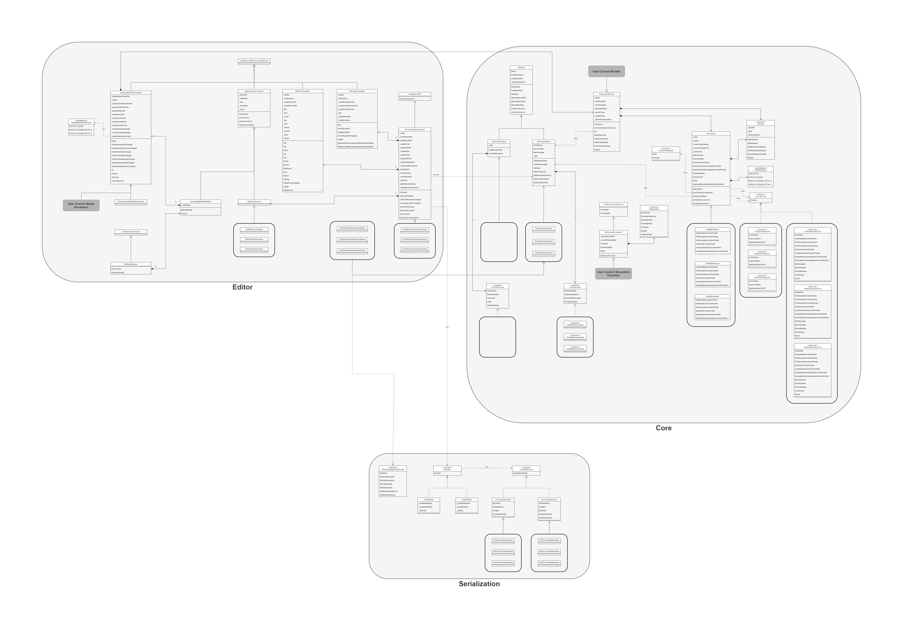

# Architecture

**dExplorer** can be devided into three parts :

 - Core : It contains all analysis computing functions/classes. This is the only independant part.
 - Editor : It contains UI classes related to the Core part.
 - Serialization : It contains serialization functions/classes of the analysis results.

ODE analysis is a "[Bursted](https://docs.unity3d.com/Packages/com.unity.burst@1.7/manual/index.html)" [multithreaded](https://docs.unity3d.com/2021.2/Documentation/Manual/JobSystem.html) computation for performance reasons.

An analysis with `n` parameter steps and `m` solving types generates :
 - `n * (m+1)` simulation jobs : they compute variable values according to the parameter step and the solving type (the additionnal job is the analytical solution)
 - `n * m` analysis jobs : they compare the difference between a specific solving type result and the analytical solution

[ADD ANALYSIS DIAGRAM]
