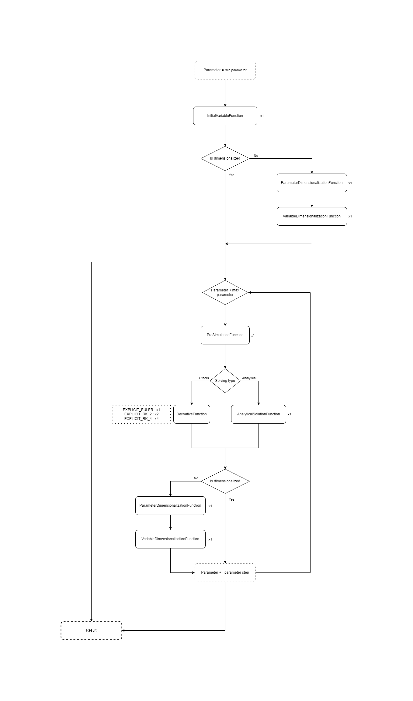

# Custom ODE model

Custom [ODE](Introduction.md) models can (must) be added by inheriting from two abstract classes :

 - `AnalysableDEModel`
 - `AnalysableDEModelVisualizer`

> [Classic drag model](https://en.wikipedia.org/wiki/Drag_(physics)#The_drag_equation) without additional force will be used as example :
> 
> `v' = -0.5 *  Rho * S * Cx * v(t)^2 / m`
> 
> - `Rho` is the density of the fluid [*kg.m^-3*]
> - `S` is the cross sectional area *[m^2]*
> - `Cx` is the drag coefficient *[N.A]*
> - `m` is the mass *[kg]*
> - `t` is the time parameter *[s]*
> - `v` is the speed relative to the fluid *[m.s^-1]*, `v >= 0`
> - `v'` is the acceleration relative to the fluid *[m.s^-2]*
> - `t_min = 0` and `v(t_min) = v_init`

## AnalysableDEModel

`AnalysableDEModel` is the core class of the model.

> The empty model class :
> ```
> [BurstCompile]
> public unsafe class DragModel : AnalysableDEModel { }
> ```

It contains all computing functions for the analysis :

 - `InitialVariableFunction` : Get the value of the variable at the beginning of the simulation
 - `PreSimulationFunction` : Execute the code at the beginning of each parameter iteration 
 - `PostSimulationFunction` : Execute the code at the end of each parameter iteration 
 - `DerivativeFunction` : Compute the derivative of the variable
 - `AnalyticalSolutionFunction` : Compute the analytical solution of the model
 - `VariableDimensionalizationFunction` : [Dimensionalize](https://en.wikipedia.org/wiki/Nondimensionalization) the non-dimensionalized variable (if the model is non-dimensionnalized)
 - `ParameterNondimensionalizationFunction` : [Non-dimensionalize](https://en.wikipedia.org/wiki/Nondimensionalization) the parameter (if the model is non-dimensionnalized)
 - `ParameterDimensionalizationFunction` : [Dimensionalize](https://en.wikipedia.org/wiki/Nondimensionalization) the non-dimensionalized parameter (if the model is non-dimensionnalized)

and a few additional methods :

 - `InitAnalysis` : First method called during the analysis
 - `GenerateDefaultDescriptions` : Analysis description in the [analysis report](Analysis_Report.md)

Computing functions are non-generic Delegates and several variable types are available (`float` and `float2`). Delegates names differs therefore according to the variable type of the model.

> The drag model has only the longitudinal speed (`v`) as variable (dimension 1). The selected Delegates are therefore :
> 
> - `FloatInitialVariableFunction`
> - `FloatPreSimulationFunction`
> - `FloatPostSimulationFunction`
> - `FloatDerivativeFunction`
> - `FloatAnalyticalSolutionFunction`
> - `FloatVariableDimensionalizationFunction`

Delegates customize the behaviour of the [simulation job](Architecture.md) :



All model data have to be stored in the `_model` attribute containing two static arrays :

 - The constant data array
 - The temporay data array

> Drag model has 5 constant data :
>  - mass `m`
>  - fluid density `Rho`
>  - reference surface `S`
>  - drag coefficient `Cx`
>  - initial speed `v_init`
>  
>   and 1 temporary data :
>  - coefficient A : `-0.5 *  Rho * S * Cx / m`
>  
> ```
>    #region Properties
>    public float Mass
>    {
>       get { return _model.GetDataValue(0); }
>       set { _model.SetDataValue(0, value); }
>    }
>   
>    public float FluidDensity
>    {
>       get { return _model.GetDataValue(1); }
>       set { _model.SetDataValue(1, value); }
>    }
>   
>    public float ReferenceSurface
>    {
>       get { return _model.GetDataValue(2); }
>       set { _model.SetDataValue(2, value); }
>    }
>   
>    public float DragCoefficient
>    {
>       get { return _model.GetDataValue(3); }
>       set { _model.SetDataValue(3, value); }
>    }
>   
>    public float InitialSpeed
>    {
>       get { return _model.GetDataValue(4); }
>       set { _model.SetDataValue(4, value); }
>    }
>    
>    // Add t_min = 0 condition
>    public override float MinParameter
>    {
>       get { return _minParameter; }
>       set 
>       { 
>         _minParameter = 0.0f;
>         _maxParameter = math.max(0.0f, _maxParameter);
>       }
>    }
>    #endregion Properties
>    
>    #region Methods
>    protected override void InitAnalysis()
>    {
>      float coefficientA = 0.5f * FluidDensity * ReferenceSurface * DragCoefficient / Mass;
>      _model.SetTemporaryDataValue(0, coefficientA);
>    }
>    #endregion Methods
> ```
> 
> The drag equation can be [non-dimensionalized](Simple_Drag_Model_Solving.md). The new variable is `V` and the new parameter is `T` :
> 
> `V = v / v_init`
> 
> `T = v_init * A * t` with `A = 0.5 * Rho * S * Cx`
> 
> ```
>    #region Static Methods
>    [BurstCompile]
>    [MonoPInvokeCallback(typeof(ParameterNondimensionalizationFunction))]
>    public static float NondimensionalizeParameter(in DEModel model, float parameter)
>    {
>      float coefficientA = model.TemporaryData[0];
>      return InitialSpeed * coefficientA * parameter;
>    }
>    
>    [BurstCompile]
>    [MonoPInvokeCallback(typeof(ParameterDimensionalizationFunction))]
>    public static float DimensionalizeParameter(float* modelData, float* modelTemporaryData, float nonDimensionalizedParameter)
>    {
>      float initialSpeed = modelData[4]
>      float coefficientA = modelTemporaryData[0];
>      return nonDimensionalizedParameter / (initialSpeed * coefficientA);
>    }
>    
>    [BurstCompile]
>    [MonoPInvokeCallback(typeof(FloatVariableDimensionalizationFunction))]
>    public static void DimensionalizeVariable(float* modelData, float* modelTemporaryData, float* nonDimensionalizedVariable, float* dimensionalizedVariable)
>    {
>      float initialSpeed = modelData[4]
>      *dimensionalizedVariable = *nonDimensionalizedVariable * initialSpeed;
>    }
>    #endregion Static Methods
> ```
> 
> The [non-dimensionalized equation](Simple_Drag_Model_Solving.md) is :
> 
> `dV / dT = -V * V`
> 
> and the [non-dimensionalized analytical solution](Simple_Drag_Model_Solving.md) is :
> 
> `V(T) = 1.0f / (T + 1.0f)`
> 
> ```
>    #region Static Methods
>    [BurstCompile]
>    [MonoPInvokeCallback(typeof(FloatInitialVariableFunction))]
>    public static void GetInitialVariable(float* modelData, float* modelTemporaryData, float* initialVariable)
>    {
>      *initialVariable = 1.0f;
>    }
>    
>    [BurstCompile]
>    [MonoPInvokeCallback(typeof(FloatDerivativeFunction))]
>    public static void ComputeDerivative(float* modelData, float* modelTemporaryData, float* currentVariable, float currentParameter, float* currentDerivative)
>    {
>      float speedRatio = *currentVariable;
>      *currentDerivative = -speedRatio * speedRatio;
>    }
>    
>    [BurstCompile]
>    [MonoPInvokeCallback(typeof(FloatAnalyticalSolutionFunction))]
>    public static void ComputeAnalyticalSolution(float* modelData, float* modelTemporaryData, float currentParameter, float *currentVariable)
>    {
>      *currentVariable = 1.0f / (currentParameter + 1.0f);
>    }
>    #endregion Static Methods
> ```
> 
> `FloatPreSimulationFunction` and `FloatPostSimulationFunction` are not used.
> 
> The final implementation of the drag model : 
> 
> ```
> [BurstCompile]
> public unsafe class DragModel : AnalysableDEModel 
> { 
>    #region Properties
>    public float Mass
>    {
>       get { return _model.GetDataValue(0); }
>       set { _model.SetDataValue(0, value); }
>    }
>   
>    public float FluidDensity
>    {
>       get { return _model.GetDataValue(1); }
>       set { _model.SetDataValue(1, value); }
>    }
>   
>    public float ReferenceSurface
>    {
>       get { return _model.GetDataValue(2); }
>       set { _model.SetDataValue(2, value); }
>    }
>   
>    public float DragCoefficient
>    {
>       get { return _model.GetDataValue(3); }
>       set { _model.SetDataValue(3, value); }
>    }
>   
>    public float InitialSpeed
>    {
>       get { return _model.GetDataValue(4); }
>       set { _model.SetDataValue(4, value); }
>    }
>    
>    // Add t_min = 0 condition
>    public override float MinParameter
>    {
>       get { return _minParameter; }
>       set 
>       { 
>         _minParameter = 0.0f;
>         _maxParameter = math.max(0.0f, _maxParameter);
>       }
>    }
>    #endregion Properties
>    
>    #region Constructors
>    public SimpleDragModel(float mass = 1.0f, float fluidDensity = 0.0f, 
>      float referenceSurface = 0.0f, float dragCoefficient = 0.0f, float initialSpeed = 0.0f) :
>      base(5, 1, Allocator.Persistent, GetInitialVariable, PreSimulate, PostSimulate, ComputeDerivative, 
>      ComputeAnalyticalSolution, DimensionalizeVariable, NondimensionalizeParameter, DimensionalizeParameter)
>    {
>      Mass = mass;
>      FluidDensity = fluidDensity;
>      ReferenceSurface = referenceSurface;
>      DragCoefficient = dragCoefficient;
>      InitialSpeed = initialSpeed;
>    }
>    #endregion Constructors
>    
>    #region Methods
>    protected override void InitAnalysis()
>    {
>      float coefficientA = 0.5f * FluidDensity * ReferenceSurface * DragCoefficient / Mass;
>      _model.SetTemporaryDataValue(0, coefficientA);
>    }
>    
>    protected override void GenerateDefaultDescriptions(out string shortDescription, out string longDescription)
>    {
>      shortDescription = "Classic drag model";
>      longDescription =
>      "Parameter :\n" +
>      "-> Elapsed Time [s]\n\n" +
>      "Parameter Step :\n" +
>      "-> Time Step [s]\n\n" +
>      "Mean Absolute Errors :\n" +
>      "-> Object speed [m/s]";
>    }
>    #endregion Methods
>    
>    #region Static Methods
>    [BurstCompile]
>    [MonoPInvokeCallback(typeof(FloatPreSimulationFunction))]
>    public static void PreSimulate(float* modelData, float* modelTemporaryData, float* currentVariable, float* currentParameter) { }
>    
>    [BurstCompile]
>    [MonoPInvokeCallback(typeof(FloatPostSimulationFunction))]
>    	public static void PostSimulate(float* modelData, float* modelTemporaryData, float* nextVariable) { }
>    	
>    	[BurstCompile]
>    [MonoPInvokeCallback(typeof(FloatInitialVariableFunction))]
>    public static void GetInitialVariable(float* modelData, float* modelTemporaryData, float* initialVariable)
>    {
>      *initialVariable = 1.0f;
>    }
>    
>    [BurstCompile]
>    [MonoPInvokeCallback(typeof(FloatDerivativeFunction))]
>    public static void ComputeDerivative(float* modelData, float* modelTemporaryData, float* currentVariable, float currentParameter, float* currentDerivative)
>    {
>      float speedRatio = *currentVariable;
>      *currentDerivative = -speedRatio * speedRatio;
>    }
>    
>    [BurstCompile]
>    [MonoPInvokeCallback(typeof(FloatAnalyticalSolutionFunction))]
>    public static void ComputeAnalyticalSolution(float* modelData, float* modelTemporaryData, float currentParameter, float *currentVariable)
>    {
>      *currentVariable = 1.0f / (currentParameter + 1.0f);
>    }
>
>    [BurstCompile]
>    [MonoPInvokeCallback(typeof(ParameterNondimensionalizationFunction))]
>    public static float NondimensionalizeParameter(in DEModel model, float parameter)
>    {
>      float coefficientA = model.TemporaryData[0];
>      return InitialSpeed * coefficientA * parameter;
>    }
>    
>    [BurstCompile]
>    [MonoPInvokeCallback(typeof(ParameterDimensionalizationFunction))]
>    public static float DimensionalizeParameter(float* modelData, float* modelTemporaryData, float nonDimensionalizedParameter)
>    {
>      float initialSpeed = modelData[4]
>      float coefficientA = modelTemporaryData[0];
>      return nonDimensionalizedParameter / (initialSpeed * coefficientA);
>    }
>    
>    [BurstCompile]
>    [MonoPInvokeCallback(typeof(FloatVariableDimensionalizationFunction))]
>    public static void DimensionalizeVariable(float* modelData, float* modelTemporaryData, float* nonDimensionalizedVariable, float* dimensionalizedVariable)
>    {
>      float initialSpeed = modelData[4]
>      *dimensionalizedVariable = *nonDimensionalizedVariable * initialSpeed;
>    }
>    #endregion Static Methods
> }
> ```

## AnalysableDEModelVisualizer

`AnalysableDEModelVisualizer` is the user interface of `AnalysableDEModel`. It is not essential if the analysis is not lauched via the [tool](Introduction.md#how-to-use-it-).

> The empty model interface class :
> ```
> public class DragModelVisualizer : AnalysableDEModelVisualizer { }
> ```

It contains 2 abstract methods :
 - `GetName` : Get the display name of the model
 - `InstantiateModel` : Instantiate the corresponding `AnalysableDEModel` class

> ```
>   #region Methods
>   public override string GetName()
>   {
>     return "Drag";
>   }
>   
>   public override AnalysableDEModel InstantiateModel()
>   {
>     return new SimpleDragModel();
>   }
>   #endregion Methods
> ```

and all additional fields :

> ```
>   #region Fields
>   private FloatField _massField;
>   private FloatField _fluidDensityField;
>   private FloatField _referenceSurfaceField;
>   private FloatField _dragCoefficientField;
>   private FloatField _initialSpeedField;
>   #endregion Fields
>   
>   #region Methods
>   [MethodImpl(MethodImplOptions.AggressiveInlining)]
>   private void OnMassChanged(ChangeEvent<float> evt)
>   {
>     if (_model != null)
>     {
>       DragModel model = (_model as DragModel);
>       model.Mass = math.max(0.0f, evt.newValue);
>       _massField.value = model.Mass;
>     }
>   }
>   
>   [MethodImpl(MethodImplOptions.AggressiveInlining)]
>   private void OnFluidDensityChanged(ChangeEvent<float> evt)
>   {
>     if (_model != null)
>     {
>       DragModel model = (_model as DragModel);
>       model.FluidDensity = math.max(0.0f, evt.newValue);
>       _fluidDensityField.value = model.FluidDensity;
>     }
>   }
>
>   [MethodImpl(MethodImplOptions.AggressiveInlining)]
>   private void OnReferenceSurfaceChanged(ChangeEvent<float> evt)
>   {
>     if (_model != null)
>     {
>       DragModel model = (_model as DragModel);
>       model.ReferenceSurface = math.max(0.0f, evt.newValue);
>       _referenceSurfaceField.value = model.ReferenceSurface;
>     }
>   }
>
>   [MethodImpl(MethodImplOptions.AggressiveInlining)]
>   private void OnDragCoefficientChanged(ChangeEvent<float> evt)
>   {
>     if (_model != null)
>     {
>       DragModel model = (_model as DragModel);
>       model.DragCoefficient = math.max(0.0f, evt.newValue);
>       _dragCoefficientField.value = model.DragCoefficient;
>     }
>   }
>
>   [MethodImpl(MethodImplOptions.AggressiveInlining)]
>   private void OnInitialSpeedChanged(ChangeEvent<float> evt)
>   {
>     if (_model != null)
>     {
>       DragModel model = (_model as DragModel);
>       model.InitialSpeed = math.max(0.0f, evt.newValue);
>       _initialSpeedField.value = model.InitialSpeed;
>     }
>   }
>
>   public override void Init()
>   {
>     base.Init();
>     
>     _minParameterField.label = "Initial Time [s]";
>     _maxParameterField.label = "Final Time [s]";
>     _maxParameterStepField.label = "Max Time Step [s]";
>     _minParameterStepField.label = "Min Time Step [s]";
>
>     _massField = new FloatField("Mass [kg]");
>     _massField.RegisterValueChangedCallback(OnMassChanged);
>
>     _fluidDensityField = new FloatField("Density [kg/m^3]");
>     _fluidDensityField.RegisterValueChangedCallback(OnFluidDensityChanged);
>
>     _referenceSurfaceField = new FloatField("Reference Surface [m^2]");
>     _referenceSurfaceField.RegisterValueChangedCallback(OnReferenceSurfaceChanged);
>
>     _dragCoefficientField = new FloatField("Drag Coefficient");
>     _dragCoefficientField.RegisterValueChangedCallback(OnDragCoefficientChanged);
>
>     _initialSpeedField = new FloatField("Initial Speed [m/s]");
>     _initialSpeedField.RegisterValueChangedCallback(OnInitialSpeedChanged);
>
>     Add(_massField);
>     Add(_fluidDensityField);
>     Add(_referenceSurfaceField);
>     Add(_dragCoefficientField);
>     Add(_initialSpeedField);
>   }
>   #endregion Methods
> ```
>
> The final implementation of the drag model interface : 
>
> ```
> public class DragModelVisualizer : AnalysableDEModelVisualizer 
> {
>   #region Fields
>   private FloatField _massField;
>   private FloatField _fluidDensityField;
>   private FloatField _referenceSurfaceField;
>   private FloatField _dragCoefficientField;
>   private FloatField _initialSpeedField;
>   #endregion Fields
>
>   #region Methods
>   public override string GetName()
>   {
>     return "Drag";
>   }
>   
>   public override AnalysableDEModel InstantiateModel()
>   {
>     return new SimpleDragModel();
>   }
>
>   [MethodImpl(MethodImplOptions.AggressiveInlining)]
>   private void OnMassChanged(ChangeEvent<float> evt)
>   {
>     if (_model != null)
>     {
>       DragModel model = (_model as DragModel);
>       model.Mass = math.max(0.0f, evt.newValue);
>       _massField.value = model.Mass;
>     }
>   }
>   
>   [MethodImpl(MethodImplOptions.AggressiveInlining)]
>   private void OnFluidDensityChanged(ChangeEvent<float> evt)
>   {
>     if (_model != null)
>     {
>       DragModel model = (_model as DragModel);
>       model.FluidDensity = math.max(0.0f, evt.newValue);
>       _fluidDensityField.value = model.FluidDensity;
>     }
>   }
>
>   [MethodImpl(MethodImplOptions.AggressiveInlining)]
>   private void OnReferenceSurfaceChanged(ChangeEvent<float> evt)
>   {
>     if (_model != null)
>     {
>       DragModel model = (_model as DragModel);
>       model.ReferenceSurface = math.max(0.0f, evt.newValue);
>       _referenceSurfaceField.value = model.ReferenceSurface;
>     }
>   }
>
>   [MethodImpl(MethodImplOptions.AggressiveInlining)]
>   private void OnDragCoefficientChanged(ChangeEvent<float> evt)
>   {
>     if (_model != null)
>     {
>       DragModel model = (_model as DragModel);
>       model.DragCoefficient = math.max(0.0f, evt.newValue);
>       _dragCoefficientField.value = model.DragCoefficient;
>     }
>   }
>
>   [MethodImpl(MethodImplOptions.AggressiveInlining)]
>   private void OnInitialSpeedChanged(ChangeEvent<float> evt)
>   {
>     if (_model != null)
>     {
>       DragModel model = (_model as DragModel);
>       model.InitialSpeed = math.max(0.0f, evt.newValue);
>       _initialSpeedField.value = model.InitialSpeed;
>     }
>   }
>
>   public override void Init()
>   {
>     base.Init();
>     
>     _minParameterField.label = "Initial Time [s]";
>     _maxParameterField.label = "Final Time [s]";
>     _maxParameterStepField.label = "Max Time Step [s]";
>     _minParameterStepField.label = "Min Time Step [s]";
>
>     _massField = new FloatField("Mass [kg]");
>     _massField.RegisterValueChangedCallback(OnMassChanged);
>
>     _fluidDensityField = new FloatField("Density [kg/m^3]");
>     _fluidDensityField.RegisterValueChangedCallback(OnFluidDensityChanged);
>
>     _referenceSurfaceField = new FloatField("Reference Surface [m^2]");
>     _referenceSurfaceField.RegisterValueChangedCallback(OnReferenceSurfaceChanged);
>
>     _dragCoefficientField = new FloatField("Drag Coefficient");
>     _dragCoefficientField.RegisterValueChangedCallback(OnDragCoefficientChanged);
>
>     _initialSpeedField = new FloatField("Initial Speed [m/s]");
>     _initialSpeedField.RegisterValueChangedCallback(OnInitialSpeedChanged);
>
>     Add(_massField);
>     Add(_fluidDensityField);
>     Add(_referenceSurfaceField);
>     Add(_dragCoefficientField);
>     Add(_initialSpeedField);
>   }
>   #endregion Methods
> }
> ```
