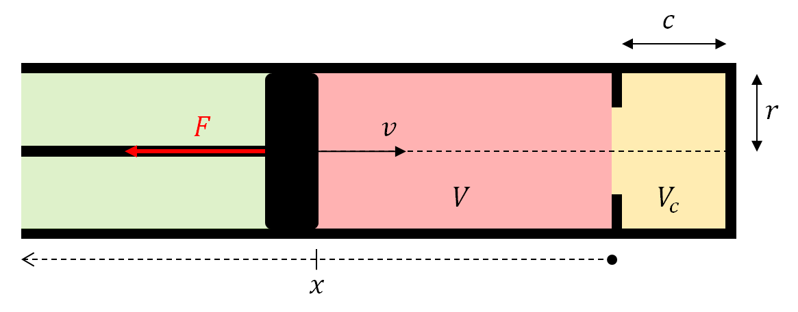
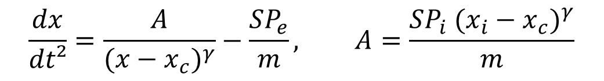

# Simple compression model solving

[Reversible adiabatic compression/expansion](https://en.wikipedia.org/wiki/Adiabatic_process) of a fluid in a cylinder without additional force :

with :

- `t` is the time parameter *[s]*
- `m` is the mass of the piston *[kg]*
- `F` is the compression/expansion force of the fluid *[N]*,
- `dx / dt²` is the acceleration of the piston *[m.s^-2]*
- `Pe` is the pressure outside of the cylinder *[N.m^-2]*
- `Vc` is the minimum total volume [m^3]
- `x_c` is the incompressible length *[m]*
- `r` is the radius of the cylinder *[m]*
- `x_m` is the maximum compressible length *[m]*

The reversible adiabatic process equation is :

with :

- `P(V)` is the current pressure *[N.m^-2]*
- `V` is the current volume *[m^3]*
- `Gamma` is the [heat capacity ratio](https://en.wikipedia.org/wiki/Heat_capacity_ratio) [N.A]
- `Pi` is the initial pressure *[N.m^-2]*
- `Vi` is the initial volume *[m^3]*

The volume of the cylinder is :

with :

- `V(x)` is the current volume *[m^3]*
- `S` is the surface of the piston [m^2]
- `x` is the current position of the piston *[m]*
- `x_c` is the incompressible length *[m]*

The current pressure is therefore :

The compression/expansion force is :

with :

- `F` is the compression/expansion force of the fluid *[N]*
- `P(x)` is the current pressure *[N.m^-2]*
- `Pe` is the pressure outside of the cylinder *[N.m^-2]*
- `S` is the surface of the piston [m^2]

The model equation is therefore :

