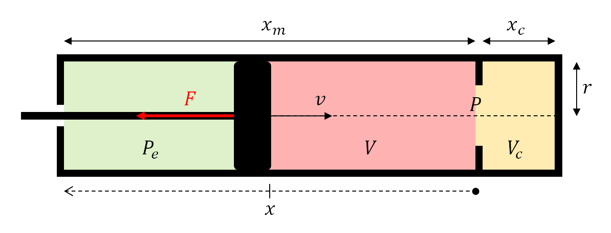

# Simple compression model solving

[Reversible adiabatic compression/expansion](https://en.wikipedia.org/wiki/Adiabatic_process) of a fluid in a cylinder without additional force :

- `t` is the time parameter *[s]*
- `m` is the mass of the piston *[kg]*
- `F` is the compression/expansion force of the fluid *[N]*,
- `dx / dt²` is the acceleration of the piston *[m.s^-2]*
- `Pe` is the pressure outside of the cylinder *[N.m^-2]*
- `Vc` is the minimum total volume [m^3]
- `c` is the incompressible length *[m]*
- `r` is the radius of the cylinder *[m]*
- `x_m` is the maximum compressible length *[m]*
