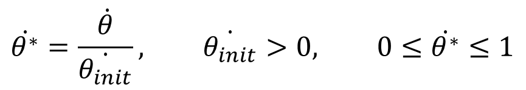

# Simple viscous friction model solving

Classic viscous friction model of a rotating cylinder in a fluid without additional force :

- `Alpha` is the viscous friction coefficient of the fluid [*N.s.m^-1*]
- `r` is the radius of the cylinder *[m]*
- `I` is the moment of inertia *[kg.m^2]*
- `t` is the time parameter *[s]*
- `Theta_dot` is the angular speed relative to the fluid *[rad.s^-1]*,
- `dTheta_dot / dt` is the angular acceleration relative to the fluid *[rad.s^-2]*

Angular speed tends towards zero over time. It can therefore be non-dimensionalized with the initial angular speed `Theta_dot_init` :

`Theta_dot_star` is the non-dimensionalized angular speed. It start with a value of 1 and tends towards zero over time.

`t_star` is the non-dimensionalized time :

The non-dimensionalized viscous friction equation is therefore :

`C` is a constant.

The non-dimensionalized analytical solution is therefore :

The position equation can be solved :

