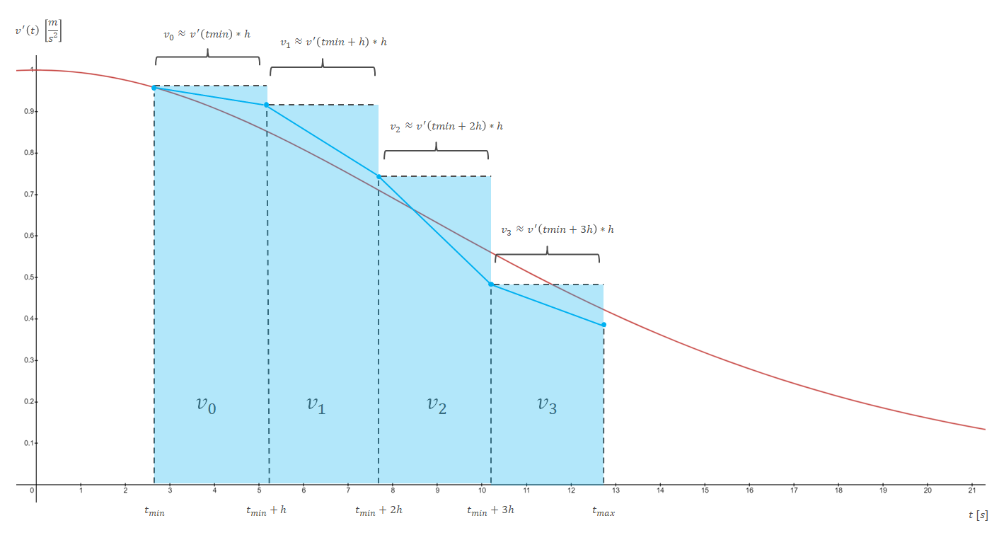

# Simulation configuration

The behaviour of [ODE](Introduction.md) simulations depends on four parameter types :

- [Model constant](Simulation_Configuration.md#model-constant)
- [Parameter range](Simulation_Configuration.md#parameter-range)
- [Parameter step](Simulation_Configuration.md#parameter-step)
- [Solving type](Simulation_Configuration.md#solving-type)

> [Classic drag model](https://en.wikipedia.org/wiki/Drag_(physics)#The_drag_equation) will be used as example :
> 
> `v' = -0.5 *  Rho * S * Cx * v(t)^2 / m + F / m`
> 
> - `Rho` is the density of the fluid [*kg.m^-3*]
> - `S` is the cross sectional area *[m^2]*
> - `Cx` is the drag coefficient *[N.A]*
> - `m` is the mass *[kg]*
> - `t` is the time parameter *[s]*
> - `v` is the speed relative to the fluid *[m.s^-1]* and `v >= 0`
> - `v'` is the acceleration relative to the fluid *[m.s^-2]*
> - `F` is the additional force *[N]* 

## Model constant

ODE models can have constant values influencing the simulation behaviour.

> `Rho`, `S`, `Cx` `m` and `F` are the model constants.
> - Configuration 1 : `m = 100`, `F = 100`, `Rho = 1.225`, `S = 1`, `Cx = 1` and `v(0) = 0`
> - Configuration 2 : `m = 200`, `F = 100`, `Rho = 1.225`, `S = 0.5`, `Cx = 0.5` and `v(0) = 0`
> 
> 

## Parameter range

Simulations must have starting and stopping conditions via the min/max parameters.

> - `t_min` is the min parameter *[s]*
> - `t_max` is the max parameter *[s]*
> - `t_min <= t <= t_max`

## Parameter step

Numerical simulations are discretized. It is therefore necessary to define the simulation frequency through the parameter step value.

NB : dExplorer doesn't handle non-constant paramater steps.

> [ADD SIMULATIONS RESULTS WITH DIFFERENT VALUES]

## Solving type

Numerical simulations are discretized. It is therefore necessary to define the simulation solving type.

If the ODE form is :

> `| v' = f(v(t),t) with  t_min <= t <= t_max`
>
> `| v' = dv / dt`

The analytical solution of `v(t_max)` is :

> `| v(t_max) = v(t_min) + INTEGRATION[t_min->t_max] (dv / dt)`
>
> `| v(t_max) = v(t_min) + INTEGRATION[t_min->t_max] (f(v(t),t))`

But the numerical solution is :

> `| v(t_max) = v(t_min) + SUM[INTEGRATION[t->t+h] (f(v(t),t)] with t_min <= t <= t_max`

`h` is the parameter step used to define the range of each integration in the sum.

It can be viewed in a graphic :

> `v'` with `m = 100`, `F = 100`, `Rho = 1.225`, `S = 1`, `Cx = 1` and `v(0) = 0`
> 
> 

Contrary to the analytical solution, the numerical solution is an approximation. In fact, each integration of the sum is computed with a specific solving type.
The selected solving type has an impact on :
 - The accuracy
 - The computational load
 - The edge conditions

### Explicit Euler

The explicit euler method is one of the simplest available solving type. It uses the [finite difference](https://en.wikipedia.org/wiki/Finite_difference_method) expression as approximation :

> `| INTEGRATION[t->t+h] (f(v(t),t)) ~= f(v(t),t) * h`
> 
> `| v(t_max) ~= v(t_min) + SUM[f(v(t),t) * h] with t_min <= t <= t_max`

It can be viewed in a graphic :

> `v'` with `m = 100`, `F = 100`, `Rho = 1.225`, `S = 1`, `Cx = 1` and `v(0) = 0`
>
> - The red curve is the analytical solution
> - The blue curve is the (fake) simulated result
>
> 

### Second order explicit Runge-Kutta 

It uses the [trapezoidal rule](https://en.wikipedia.org/wiki/Trapezoidal_rule) as approximation method of the integration parts :

> `| INTEGRATION[t->t+h] (f(v(t),t)) ~= 0.5 * h * (f(v(t),t) + f(v(t+h),t+h))`
> 
> `| v(t_max) ~= v(t_min) + SUM[0.5 * h * (f(v(t),t) + f(v(t+h),t+h))] with t_min <= t <= t_max`

### Fourth order explicit Runge-Kutta 

It uses the [Simpson's rule](https://en.wikipedia.org/wiki/Simpson%27s_rule) as approximation method of the integration parts :

> `| INTEGRATION[t->t+h] (f(v(t),t)) ~= (1/6) * h * (f(v(t),t) + 4 * f(v(0.5*(t+h)),0.5*(t+h)) + f(v(t+h),t+h))`
> 
> `| v(t_max) ~= v(t_min) + SUM[(1/6) * h * (f(v(t),t) + 4 * f(v(0.5*(t+h)),0.5*(t+h)) + f(v(t+h),t+h))] with t_min <= t <= t_max`
